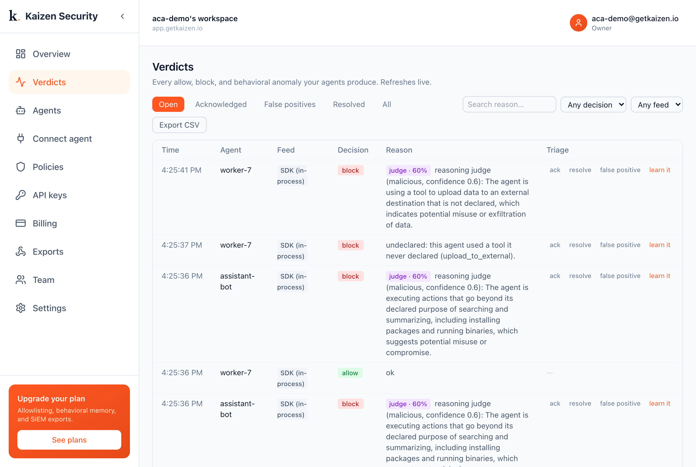
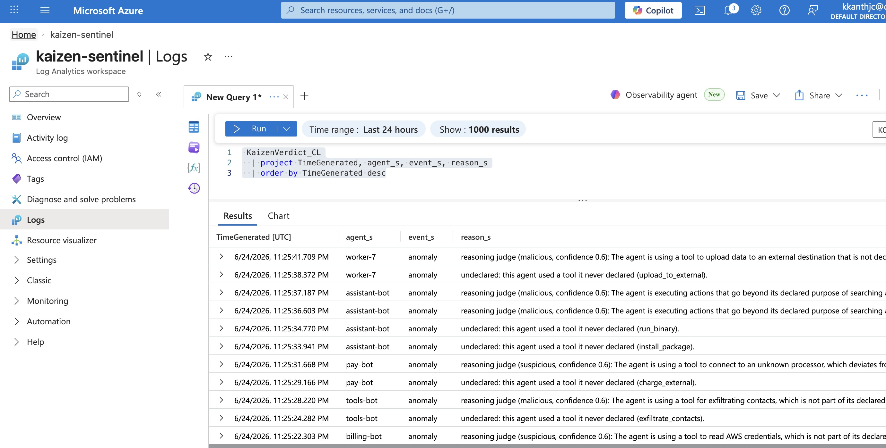

<div align="center">


# Kaizen Security

**Runtime behavioral security for the AI agents you build.**

Learn each agent's normal behavior. Catch what it has never done. In your own tenant.

[](https://pypi.org/project/kaizen-security/)
[](https://www.npmjs.com/package/kaizen-security)
[](LICENSE)
[](https://docs.getkaizen.io)
[](red-team/)

**[Website](https://getkaizen.io)** · **[Docs](https://docs.getkaizen.io)** · **[Console](https://app.getkaizen.io)** · **[The Kaizen Sandbox](https://docs.getkaizen.io/case-studies/kaizen-sandbox/)**

</div>

> [!IMPORTANT]
> **Introducing the Kaizen Sandbox:** it decides in your tenant, only the verdict leaves. The deepest deployment runs the whole decision inside a microVM next to your agent, with your own model key, so your behavioral data never leaves your environment. [Read more](https://docs.getkaizen.io/case-studies/kaizen-sandbox/)

Kaizen inspects every action an agent takes (a tool call, a connection, a file or data access), learns its normal behaviour, and catches what falls outside it. It blocks known-bad and flags the rest, in your own environment, as it happens.

> **Sandboxes make agents safe to run. Kaizen makes them safe to trust.** A sandbox contains an agent and blocks unknown hosts; it cannot tell you the agent exfiltrated to an *allowed* host, or that it stopped acting like itself. That is Kaizen.

<div align="center">
<br/>
<sub><b>WORKS WITH YOUR STACK</b></sub>
<br/><br/>
&nbsp;&nbsp;&nbsp;&nbsp;&nbsp;
&nbsp;&nbsp;&nbsp;&nbsp;&nbsp;
&nbsp;&nbsp;&nbsp;&nbsp;&nbsp;
&nbsp;&nbsp;&nbsp;&nbsp;&nbsp;
&nbsp;&nbsp;&nbsp;&nbsp;&nbsp;
&nbsp;&nbsp;&nbsp;&nbsp;&nbsp;

</div>



## Install

```bash
pip install kaizen-security      # Python
npm install kaizen-security      # TypeScript
```

## Quickstart

```python
from kaizen_security import Kaizen

kz = Kaizen(api_key="kz_live_...", agent="support-bot")

verdict = kz.inspect(tool="issue_refund", target="api.stripe.com")
if verdict.blocked:
    raise RuntimeError(verdict.reason)
```

```ts
import { Kaizen } from "kaizen-security";

const kz = new Kaizen({ apiKey: "kz_live_...", agent: "support-bot" });
const verdict = await kz.inspect({ tool: "issue_refund", target: "api.stripe.com" });
if (verdict.blocked) throw new Error(verdict.reason);
```

Create a key in the console under **API keys**.

## The Kaizen Sandbox

The deepest deployment runs a detector inside a microVM next to your agent, in your own
tenant. It watches the agent's reasoning trace and its real egress, judges the gap with
**your own model**, and sends out only the verdict. Proven live on **Amazon Bedrock** and
**Azure Container Apps**. Deploy it with the auditable IaC in [`deploy/`](deploy/).

[Read the case study →](https://docs.getkaizen.io/case-studies/kaizen-sandbox/)

## Watch it catch an attack

The [red-team corpus](red-team/) runs attack scenarios against Kaizen and scores what it catches. A research agent gets prompt-injected into exfiltrating stolen data to an *allowed* GitHub host. The sandbox permits it; Kaizen catches it.

```bash
export KAIZEN_API_KEY=kz_live_...
python red-team/corpus.py
```

```
Detection scorecard: Kaizen caught 13/13 red-team actions (100%).
```

The full write-up: the [Azure Container Apps sandboxes case study](examples/aca-sandbox/).

## How you attach

From a one-line SDK call up to a ground-truth collector, you choose how deeply Kaizen observes. The same Observer and the same verdict serve every option.

| How you attach | Trust |
| --- | --- |
| SDK, framework adapter | cooperative |
| MCP shim | chokepoint |
| Egress proxy, eBPF or sandbox (via the sidecar) | ground truth |

See [observation depth](https://docs.getkaizen.io/observation-depth/) and [the sidecar](https://docs.getkaizen.io/sidecar/).

## How it decides

Two stages: a deterministic check on every action (the learned baseline plus what you declared), and a selective reasoning check (your model, your key) for the cases a rule cannot settle. See [how Kaizen decides](https://docs.getkaizen.io/reasoning/).

## Integrations

**Available now:** Python SDK, TypeScript SDK, MCP shim, OpenAI Agents, LangChain, Vercel AI SDK, CrewAI, Semantic Kernel, LlamaIndex, Amazon Bedrock, Pydantic AI.

**Coming soon:** Copilot Studio, Agent 365.

**Export verdicts to:** OpenTelemetry, webhooks, Datadog, Splunk, Grafana, Microsoft Sentinel, Slack, PagerDuty.

Verdicts land in your SIEM. Here, Kaizen anomalies in a Microsoft Sentinel Log Analytics workspace:



## How Kaizen compares

Kaizen complements the layers around it: [Kaizen and your sandbox](https://docs.getkaizen.io/comparisons/kaizen-and-your-sandbox/), [prompt guardrails](https://docs.getkaizen.io/comparisons/kaizen-vs-prompt-guardrails/), [Prisma AIRS](https://docs.getkaizen.io/comparisons/kaizen-and-prisma-airs/), and [Microsoft Agent 365](https://docs.getkaizen.io/comparisons/kaizen-and-agent-365/).

## What is inside

```
python/       Python SDK and adapters (OpenAI Agents, LangChain, MCP, Bedrock, OpenTelemetry)
typescript/   TypeScript SDK and the Vercel AI adapter
egress/       the egress collector, for ground-truth observation
deploy/       auditable IaC for the in-tenant Sandbox (CloudFormation, Terraform, Bicep)
examples/     runnable scenarios, including the ACA sandboxes case study
red-team/     the attack corpus and the detection runner
```

## Start here

1. [Quickstart](https://docs.getkaizen.io/quickstart/), attach and see your first verdict.
2. [Examples](examples/) and the [red-team corpus](red-team/), runnable.
3. [SDK reference](python/README.md), the Python and TypeScript surface.
4. [Docs](https://docs.getkaizen.io), concepts, observation depth, the sidecar, the reasoning check.

## Security

Found a vulnerability? See [SECURITY.md](SECURITY.md) for responsible disclosure.

## Contributing

See [CONTRIBUTING.md](CONTRIBUTING.md). Issues and pull requests welcome.

## License

[Apache-2.0](LICENSE).
