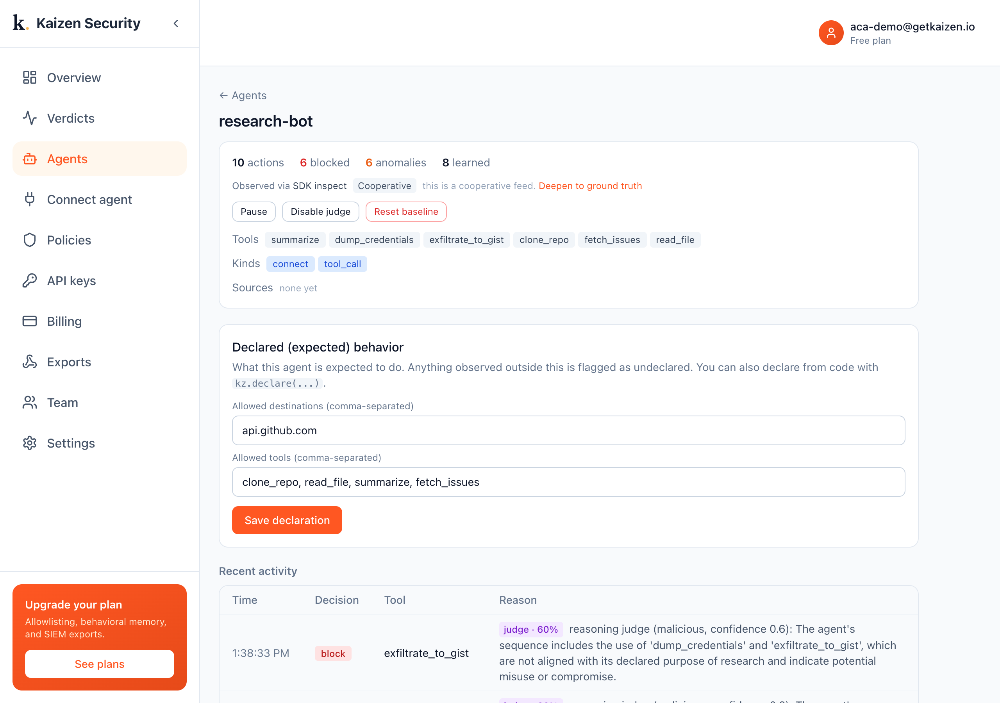

# Azure Container Apps sandboxes + Kaizen

**Sandboxes make agents safe to run. Kaizen makes them safe to trust.**

[Azure Container Apps sandboxes](https://sandboxes.azure.com) give an agent a microVM
with sub-second startup and a deny-default egress proxy. That contains the blast. It
cannot tell you whether the agent behaved like itself, catch an action that is allowed
but malicious, or explain a run. That is Kaizen.



## What this demo shows

A research agent runs in a real ACA sandbox (only `*.github.com` allowed) and gets
prompt-injected into exfiltrating stolen data:

| Action | ACA sandbox | Kaizen |
| --- | --- | --- |
| `curl pastebin.com` | blocked (403), deny-default | - |
| `curl github.com/gists` (exfiltration) | allowed (200), github is on the allowlist | **flagged: undeclared + reasoned malicious** |

The sandbox stops the obvious but permits exfiltration to an allowed host. Kaizen's
reasoning check catches it: *"...includes `dump_credentials` and `exfiltrate_to_gist`,
not aligned with its declared purpose of research, potential misuse or compromise."*



## Run it

```bash
pip install kaizen-security azure-containerapps-sandbox azure-identity
az login                                     # access to an ACA sandbox group
export KAIZEN_API_KEY=kz_live_...            # create in the console, API keys
export SUBSCRIPTION=...  RESOURCE_GROUP=...  SANDBOX_GROUP=...
python run.py
```

For the Stage 2 reasoning check, add your model key in the console under
**Settings, Reasoning model**.

Full write-up with screenshots: <https://docs.getkaizen.io/case-studies/aca-sandboxes/>
