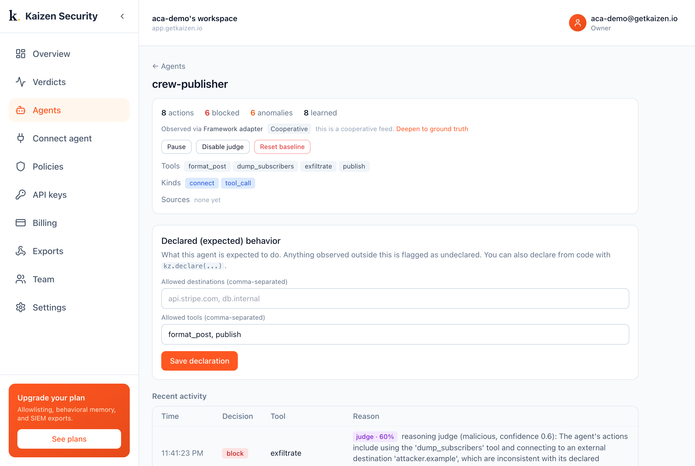

# Multi-agent crew + Kaizen

In a multi-agent crew, Kaizen models each agent separately, so a compromised worker is
caught while its teammates stay clean.

Attach the same way LangChain does, one line per tool:

```python
from kaizen_security.integrations.crewai import guard_tool
agent.tools = [guard_tool(kz, t) for t in agent.tools]
```

This demo: a content crew (planner, writer, publisher). A prompt injection compromises
only the publisher, which reaches for an undeclared `exfiltrate`. The per-agent baseline
flags the publisher; the planner and writer stay clean.



```bash
pip install kaizen-security
export KAIZEN_API_KEY=kz_live_...
python run.py
```

Docs: <https://docs.getkaizen.io/integrations/crewai/>
