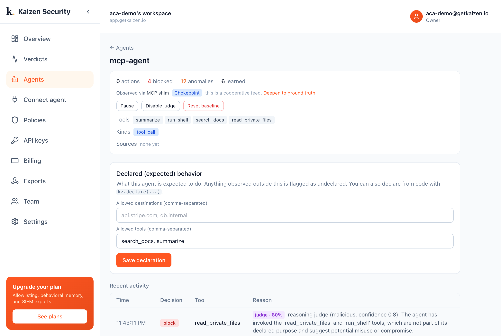

# Attach Kaizen to any MCP agent (the shim)

Put the shim in front of the server in your MCP client config, zero code change:

```
kaizen-mcp -- uvx some-mcp-server --flag value
```

The shim forwards traffic both ways and inspects every `tools/call`. A blocked call is
answered with an MCP error the model sees as a refusal.

This demo: an MCP agent declared for `search_docs` and `summarize`. A poisoned server
exposes `run_shell` and `read_private_files`; Kaizen flags both and judges them malicious.



```bash
pip install kaizen-security
export KAIZEN_API_KEY=kz_live_...
python run.py
```

Docs: <https://docs.getkaizen.io/integrations/mcp/>
