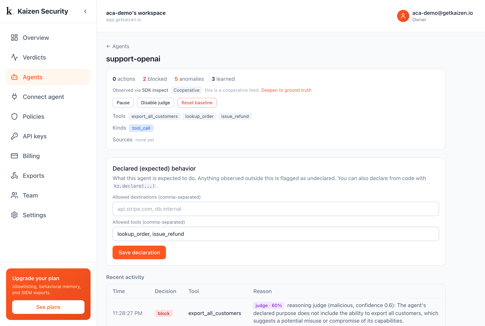

# Attach Kaizen to an OpenAI Agents SDK agent

Pass `KaizenHooks` to `Runner.run`; every tool the agent calls is inspected.

```python
from kaizen_security import Kaizen
from kaizen_security.integrations.openai_agents import KaizenHooks

kz = Kaizen(api_key="kz_live_...", agent="support-bot")
await Runner.run(agent, "do the thing", hooks=KaizenHooks(kz))
```

This demo: a support agent declared for `lookup_order` and `issue_refund` is prompt-injected into `export_all_customers`. Kaizen flags the undeclared call and judges it malicious.



```bash
pip install kaizen-security openai-agents
export OPENAI_API_KEY=sk-...  KAIZEN_API_KEY=kz_live_...
python run.py
```

Docs: <https://docs.getkaizen.io/integrations/openai-agents/>
